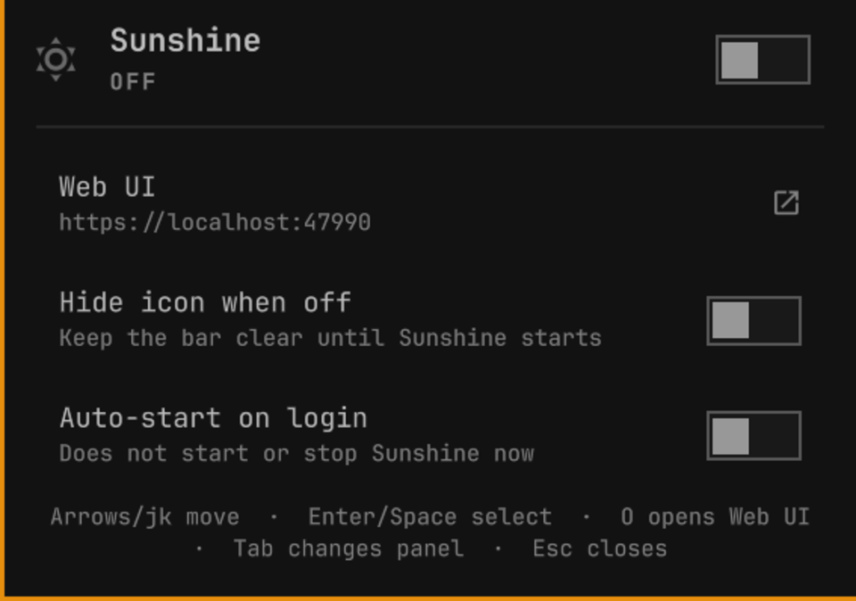

# Omarchy Sunshine

A native Omarchy bar widget for controlling Sunshine and opening its Web UI.



## Features

- Shows whether Sunshine is off, starting, on, stopping, failed, or unavailable.
- Starts or stops Sunshine from the bar or keyboard-friendly panel.
- Enables or disables Sunshine at login independently of its current state.
- Opens the local HTTPS Web UI using Sunshine's configured base port.
- Optionally hides the bar icon while Sunshine is off.
- Reports when the required Sunshine service is missing.

## Install

Plugins run as unsandboxed code inside the long-running `omarchy-shell`
process. Review third-party plugin code before installing or updating it.

Sunshine is an external dependency and must be installed separately. The
installed package must provide this exact systemd user unit:

```text
app-dev.lizardbyte.app.Sunshine.service
```

Add and enable the plugin:

```bash
omarchy plugin add https://github.com/lightqv/omarchy-sunshine.git --enable
```

The widget appears in the right bar section by default. Move it with:

```bash
omarchy bar move lightqv.sunshine --section right
```

## Use

- Left-click the icon to open or close the panel.
- Right-click the icon to start or stop Sunshine now.
- Use Arrow keys or `j`/`k` to move through panel controls.
- Use Enter or Space to activate the selected control.
- Press `o` while the Web UI row is selected to open it.
- Use Tab or Shift+Tab to switch panels and Escape to close the panel.

The header switch affects Sunshine now. **Auto-start on login** only changes
whether systemd starts Sunshine with the graphical session; it never starts or
stops the current process.

The default Web UI is `https://localhost:47990`. If
`~/.config/sunshine/sunshine.conf` contains a valid `port` setting, the plugin
opens the Web UI on the following port. A browser certificate warning is normal
with Sunshine's default self-signed certificate.

## Requirements

- A current Omarchy installation with its Quickshell shell
- Sunshine with the user unit `app-dev.lizardbyte.app.Sunshine.service`

Version 0.1.0 was tested with Omarchy 4.0.4, Quickshell 0.3.1, and Sunshine 2026.516.143833-4.1.
Omarchy and Sunshine are rolling software; revalidate the plugin after major
shell or Sunshine upgrades.

## Sunshine Tray Icon

Sunshine's native tray icon cannot be disabled separately from Sunshine's
notifications. The plugin therefore does not modify that icon, notification
behavior, or any Sunshine configuration. Use Sunshine's own controls if its
upstream behavior changes in the future.

## Session Status

Sunshine does not expose an authoritative active-session API. This plugin does
not infer connected clients from paired clients, logs, sockets, or the
GameStream busy flag, so it intentionally shows runtime status only.

## Update, Disable, Or Remove

```bash
omarchy plugin update lightqv.sunshine
omarchy plugin disable lightqv.sunshine
omarchy plugin remove lightqv.sunshine
```

Disabling or removing the plugin does not uninstall Sunshine, alter its
configuration, stop it, or change its systemd enablement.

## Troubleshooting

### Sunshine is unavailable

Confirm the exact user unit is installed and inspect its state:

```bash
systemctl --user status app-dev.lizardbyte.app.Sunshine.service
systemctl --user show app-dev.lizardbyte.app.Sunshine.service \
  --property=LoadState --property=ActiveState --property=SubState --property=UnitFileState
```

If the unit is not found, install or reinstall Sunshine outside this plugin.
After changing the Sunshine installation, restart the shell:

```bash
omarchy restart shell
```

### Web UI does not open

Confirm Sunshine is running. Check the `port` value in
`~/.config/sunshine/sunshine.conf`; the Web UI uses that base port plus one and
falls back to `47990` when the setting is absent or invalid.

### Check logs

```bash
journalctl --user -u app-dev.lizardbyte.app.Sunshine.service -b
quickshell log --tail 500 --no-color
```

Redact usernames, paths, addresses, credentials, and unrelated log entries
before sharing diagnostics publicly.

## Development

Run the local checks from an Omarchy workstation with Qt QML tooling and
Node.js available:

```bash
omarchy plugin validate .
bash scripts/check-release-metadata.sh
bash scripts/lint-qml.sh
bash scripts/test-service.sh
bash scripts/test-panel.sh
node --test tests/*.test.js
bash -n scripts/*.sh tests/helpers/fake-systemctl
git diff --check
```

See [`docs/release-checklist.md`](docs/release-checklist.md) before preparing a
release.

## License

[MIT](LICENSE)
